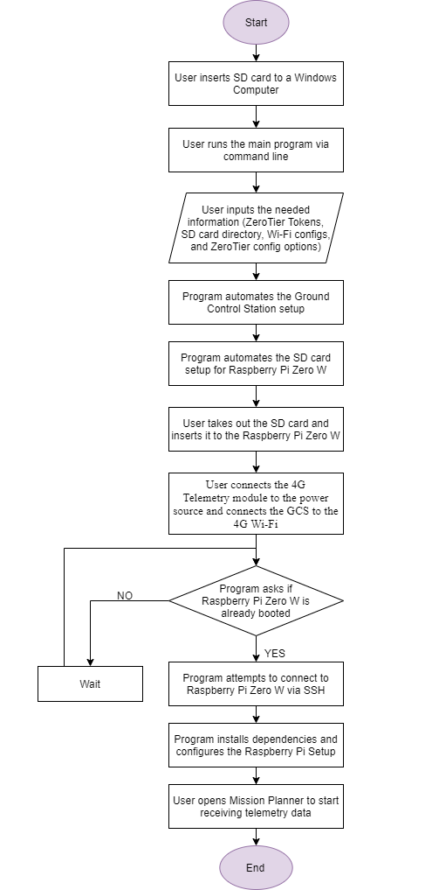

# 4G Telemetry Module Setup Automation Script

## Requirements & Installation

The programming language used is Python.

You should have pipenv (preferred) or pip to install and run.

Installation (pipenv):

    $ pipenv install -r requirements.txt

External information are required as input to the program:

- ZeroTier Central token
- ZeroTier Service token

## Run

To run the program, execute the following command (pipenv):

    $ pipenv run python main.py

## Program Flow

The figure below explains the user journey for this program.

